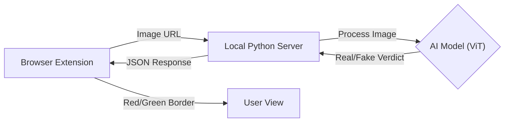

<br />
<div align="center">
  <h1 align="center">AMD Deepfake Sentry 🛡️</h1>

  <p align="center">
    <strong>A Privacy-First AI Firewall for Your Browser</strong>
    <br />
    Real-time Deepfake Detection powered by Local Edge AI
    <br />
    <br />
    <a href="#-demo">View Demo</a>
    ·
    <a href="#-installation">Installation</a>
    ·
    <a href="#-technology-stack">Tech Stack</a>
  </p>

  <p align="center">
    
    
    
    
  </p>
</div>

---

## 📋 Executive Summary

**AMD Deepfake Sentry** is a browser-based "visual firewall" designed to restore trust in the internet. As users browse social media or news sites, Sentry automatically scans images in the background and analyzes them for AI-generated artifacts.

Unlike traditional tools that rely on slow, privacy-invasive cloud APIs, Sentry processes everything **locally on the device**. By leveraging the power of **Edge AI**, we ensure:
* **0% Data Leakage:** Your browsing history never leaves your laptop.
* **Milliseconds Latency:** Instant verification without network lag.

---

## ⚙️ System Architecture

The system operates in a continuous loop between the browser and the local neural engine.



### The Three Pillars

| Component | Name | Function |
| --- | --- | --- |
| **Frontend** | **The Watchman** | A Chrome/Edge Extension that scans the DOM, filters ads/icons, and highlights threats. |
| **Backend** | **The Engine** | A local Flask server acting as the bridge between the browser and the NPU. |
| **AI Model** | **The Brain** | A pre-trained Vision Transformer (ViT) that detects pixel-level inconsistencies. |

---

## 🛠 Technology Stack

* **Core Logic:** `Python 3.12`
* **API Server:** `Flask` + `Flask-CORS`
* **AI Engine:** `Hugging Face Transformers` + `PyTorch`
* **Image Processing:** `Pillow` (PIL)
* **Browser Interface:** `JavaScript (Manifest V3)`
* **Hardware Acceleration:** Optimized for **AMD Ryzen™ AI NPU** (Simulated via CPU for prototype).

---

## 🚀 Installation

### Prerequisites

* Python 3.10 or higher
* Google Chrome or Microsoft Edge

### Step 1: Ignite the Engine (Backend)

1. Navigate to the backend folder:
```bash
cd AMD_Sentry/backend

```


2. Install the required dependencies:
```bash
pip install -r requirements.txt

```


3. Launch the server:
* **Windows:** Double-click `Start_Sentry.bat`
* **Manual:** Run `python server.py`


4. *Wait for the message:* `AMD SENTRY: MODEL READY 🟢`

### Step 2: Equip the Watchman (Frontend)

1. Open your browser and go to `chrome://extensions`.
2. Enable **Developer Mode** (Toggle in top-right).
3. Click **Load Unpacked**.
4. Select the `AMD_Sentry/extension` folder.
5. **Pin** the extension to your toolbar.

---

## 🎮 Usage Guide

1. **Start the Server:** Ensure your terminal window is open and the model is loaded.
2. **Open the Command Center:** Go to `http://127.0.0.1:5000` to view the live threat dashboard.
3. **Browse Safely:** Visit Google Images or Twitter.
* 🟩 **Green Border:** Verified Real Image.
* 🟥 **Red Border:** Detected AI Fake / Deepfake.


---

## 💡 The AMD Advantage

> *Why not just use a Cloud API?*

Sending every image a user sees to a cloud server is a privacy nightmare and creates massive latency.

**Our "Edge AI" Solution:**
Our architecture runs the inference **locally**.

* **Privacy:** Personal browsing data never leaves the laptop.
* **Latency:** No network round-trip time. Analysis happens in milliseconds.
* **Future Roadmap:** While the prototype uses PyTorch, the production version will compile this model to **ONNX format** to run specifically on the **AMD Ryzen™ AI NPU**, offloading work from the main CPU/GPU to save battery life.

---

## 📂 Project Structure

```text
AMD_Sentry/
├── backend/                  # The "Brain" (Flask + AI)
│   ├── server.py             # Main Application Logic
│   ├── requirements.txt      # Dependency List
│   ├── Start_Sentry.bat      # One-Click Launcher
│   └── templates/
│       └── dashboard.html    # Live Command Center UI
│
└── extension/                # The "Eyes" (Browser Extension)
    ├── manifest.json         # Extension Configuration
    ├── background.js         # Background Service Worker
    ├── content.js            # DOM Manipulation Script
    └── popup.html            # Extension Popup Menu

```

---
